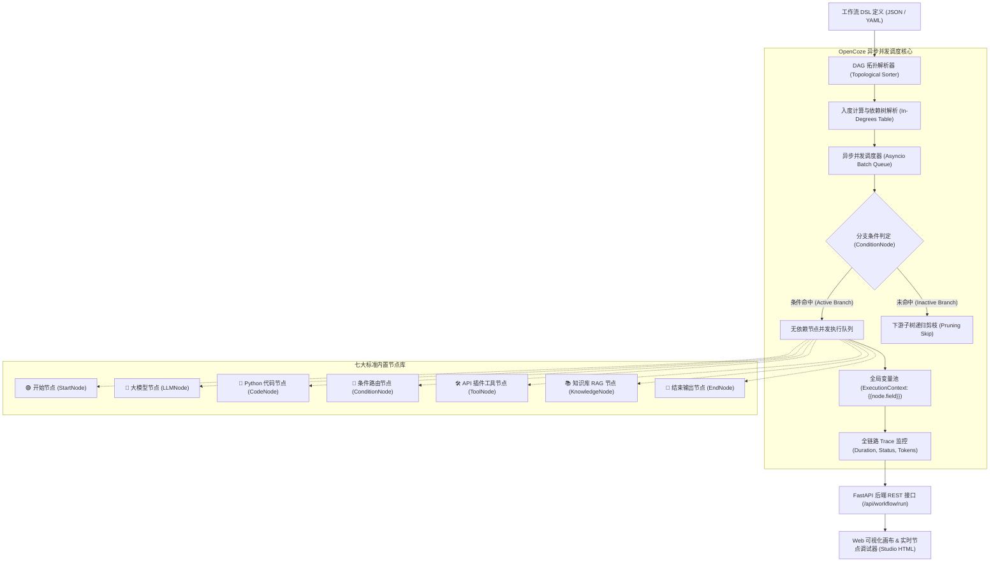

<div align="center">

# 🚀 OpenCoze

### 现代、轻量、高可扩展的开源 AI 工作流编排与智能体构建平台
*A Production-Ready, DAG-Based AI Workflow & Agent Platform in Pure Python.*

[](https://opensource.org/licenses/MIT)
[](https://www.python.org/downloads/)
[](https://fastapi.tiangolo.com)
[](#-核心系统架构)
[%20%7C%20DeepSeek%20%7C%20Ollama%20%7C%20Mock-success.svg)](#-模型支持与生态配置)

[项目理念](#-设计哲学) | [核心架构](#-核心系统架构) | [标准节点库](#-标准内置节点库) | [实战案例](#-预置端到端业务模板) | [快速上手](#-快速上手) | [English](#-english-overview)

</div>

---

## 💡 设计哲学

类似 **Coze（扣子）**、**Dify** 的 AI 工作流平台，其核心本质是：**“基于有向无环图（DAG）的结构化数据流计算图”**。

传统简单调用大模型的方案往往面临以下痛点：
* ❌ **单 Prompt 脆弱性**：试图在一个长 Prompt 里完成清洗、检索、推理、分类，极易引发幻觉或输出格式错乱；
* ❌ **无法精确控制分支**：业务中存在大量“是/否”、“及格/不及格”或多路意图，单靠大模型难以稳定分流；
* ❌ **缺乏确定性计算能力**：大模型并不擅长做精确的字符串清洗、数学运算或复杂格式转换。

**OpenCoze 为解决复杂 AI 业务工程化而生。**  
它将大模型的推理泛化力，与 Python 脚本的确定性计算、条件分支网关、向量知识检索与全链路 Trace 观测深度结合，提供开箱即用、零繁琐依赖的轻量级工作流引擎与可视化 Studio 画布。

---

## 🏗️ 核心系统架构



---

## 🧩 标准内置节点库

OpenCoze 开箱提供 7 大工业级基础节点，覆盖从数据输入、中间清洗、逻辑分支到大模型生成全流程：

| 节点类型 | 标识 | 核心功能与运行机制 | 典型配置样例 |
| :--- | :--- | :--- | :--- |
| **开始节点** | `start` | 工作流入口，定义并校验用户启动参数，将初始数据注入全局数据管道。 | `{"fields": {"topic": {"default": "AI"}}}` |
| **结束节点** | `end` | 工作流终点，支持基于 `{{node.field}}` 的富文本 Markdown 模板合成输出。 | `{"response": "# {{llm.title}}\n{{llm.text}}"}` |
| **大模型节点** | `llm` | 动态插值 Prompt，调用大模型（智谱/DeepSeek/Ollama/OpenAI）生成内容。 | `{"model": "glm-4-flash", "prompt": "分析: {{code.out}}"}` |
| **Python 代码节点** | `code` | 在受限安全命名空间中运行用户自定义的 `def main(inputs):` Python 脚本。 | `def main(inputs): return {'clean': inputs['raw'].strip()}` |
| **条件分支节点** | `condition` | 逻辑门比较（`==`, `!=`, `>`, `<`, `>=`, `<=`, `contains`），激活对应分支并对非激活分支**智能剪枝**。 | `{"left_var": "{{code.score}}", "operator": ">=", "right_value": "60"}` |
| **工具插件节点** | `tool` | 发起标准 REST HTTP 请求（GET/POST/JSON）或调用本地内置工具（时间、计算）。 | `{"url": "https://api.example.com", "method": "POST"}` |
| **知识库节点** | `knowledge` | 基于用户提问对知识库切片进行语义近似检索，输出 Top-K 上下文供大模型参考。 | `{"query": "{{start.question}}", "top_k": 2}` |

---

## 🎯 预置端到端业务模板

系统内置 3 套开箱即用的工业级实战工作流（位于 `opencoze/templates/`），可在 Web 画布或终端一键运行：

### 1. 📊 标杆竞品深度商业研报流 (`competitor_analysis`)
* **链路**：`StartNode`（输入行业与标杆产品）➔ `CodeNode`（自动构建 4 维评估大纲）➔ `LLMNode`（战略级深度研报撰写）➔ `EndNode`（生成 Markdown 报告）。
* **应用价值**：告别泛泛而谈的问答，自动生成具备深度结构化视角的战略商业研报。

### 2. 🛡️ 客诉意图智能分类与自动分流流 (`ticket_router`)
* **链路**：`StartNode`（客户留言）➔ `CodeNode`（情绪粗筛与 12315 关键词捕获）➔ `ConditionNode`（紧急度判断）：
  * **分支 A (紧急客诉)**：➔ `ToolNode`（调用工单系统创建紧急工单）➔ `LLMNode`（高情商共情安抚话术）➔ `EndNode`；
  * **分支 B (常规咨询)**：➔ `LLMNode`（常规自助业务解答）➔ `EndNode`。
* **应用价值**：生产级客服中枢必备的分流与风控兜底模式。

### 3. 📚 知识库 RAG 严谨问答流 (`knowledge_rag`)
* **链路**：`StartNode`（用户提问）➔ `KnowledgeNode`（企业知识库检索切片）➔ `LLMNode`（严格受知识库约束的无幻觉解答）➔ `EndNode`。
* **应用价值**：结合专有文档提供权威问答。

---

## 🚀 快速上手

### 1. 安装依赖

推荐使用 Python 3.10+ 环境：

```bash
git clone https://github.com/guan110110/OpenCoze.git
cd OpenCoze

pip install -r requirements.txt
```

### 2. 配置大模型密钥（可选）

创建 `.env` 文件（或直接复制模板 `copy .env.example .env`）：

```ini
# 方案 A: 智谱 AI (推荐! 官方 GLM-4-Flash 永久免费，极速稳定)
ZHIPU_API_KEY=your_zhipu_api_key_here

# 方案 B: DeepSeek 官方 API
# DEEPSEEK_API_KEY=your_deepseek_api_key_here

# 方案 C: 本地私有化 Ollama (纯离线免费，无需填 Key，启动 ollama 即可自动发现)
# OLLAMA_BASE_URL=http://localhost:11434/v1
```

> 💡 **零成本上手**：即便不填写任何 Key，系统亦内置了智能 Mock 仿真引擎，全套分支与拓扑流转 100% 可正常体验！

### 3. 启动 Web 可视化 Studio 画布（最推荐）

```bash
python opencoze/web/server.py
```
终端启动后，浏览器打开 **`http://127.0.0.1:8502`** 即可进入现代化工作流 Studio：
* 在画布中查看节点间贝塞尔曲线连线；
* 点击顶部模板下拉框，一键加载预置流；
* 修改输入参数，点击 **“▶ 运行工作流”**，观察节点实时点亮变色；
* 在右侧抽屉中复盘全链路毫秒级 Trace 与节点输出数据包！

### 4. 命令行一键运行 (CLI)

适合脚本自动化或 Linux 服务器调试：

```bash
python -m opencoze.cli competitor_analysis -i '{"topic": "具身智能机器人", "target": "特斯拉 Optimus"}'
```

### 5. Python 开发者 SDK 嵌入调用

在您自己的业务系统或微服务中直接调用工作流：

```python
import asyncio
from opencoze.engine import WorkflowEngine
from opencoze.templates import COMPETITOR_ANALYSIS_WORKFLOW
from opencoze.config import get_llm_client

async def main():
    # 1. 自动连接模型
    client, model, provider = get_llm_client()
    
    # 2. 实例化引擎
    engine = WorkflowEngine(COMPETITOR_ANALYSIS_WORKFLOW, llm_client=client)
    
    # 3. 执行工作流
    result = await engine.run({
        "topic": "大模型智能体平台",
        "target": "Coze vs Dify"
    })
    
    print("最终结果:\n", result["result"])
    print("节点 Trace 耗时:\n", result["traces"])

asyncio.run(main())
```

---

## 🧪 自动化测试验证

项目内置了严格的测试用例，覆盖变量求值、拓扑排序、环形死锁检测、条件分支剪枝与端到端实战：

```bash
python -m pytest tests/ -v
```

测试执行结果：
```text
tests/test_condition_pruning.py::test_condition_true_branch PASSED       [ 12%]
tests/test_engine_dag.py::test_linear_dag_execution PASSED               [ 25%]
tests/test_engine_dag.py::test_cycle_detection PASSED                    [ 37%]
tests/test_variable.py::test_single_variable_interpolation PASSED        [ 50%]
tests/test_variable.py::test_nested_dict_and_list_resolution PASSED      [ 62%]
tests/test_workflows.py::test_competitor_analysis_template_e2e PASSED    [ 75%]
tests/test_workflows.py::test_ticket_router_template_e2e PASSED          [ 87%]
tests/test_workflows.py::test_knowledge_rag_template_e2e PASSED          [100%]
============================== 8 passed in 55s ==============================
```

---

## 📁 项目目录结构

```
OpenCoze/
├── opencoze/                   # 核心开源框架源码
│   ├── __init__.py
│   ├── context.py              # ExecutionContext、NodeTrace 与状态流转
│   ├── variable.py             # 变量插值解析器 ({{node.field}} 任意嵌套支持)
│   ├── engine.py               # DAG 核心调度器 (拓扑解析、异步并发、分支剪枝)
│   ├── config.py               # 多模型供应商自适应配置层
│   ├── cli.py                  # 终端命令行工具
│   ├── nodes/                  # 标准节点库实现
│   │   ├── __init__.py
│   │   ├── base.py             # BaseNode 基础协议
│   │   ├── start.py            # 开始节点
│   │   ├── end.py              # 结束节点
│   │   ├── llm.py              # 大模型调用节点
│   │   ├── code.py             # Python 代码沙箱节点
│   │   ├── condition.py        # 条件分支与逻辑门节点
│   │   ├── tool.py             # HTTP 请求与工具插件节点
│   │   └── knowledge.py        # 向量知识库与 RAG 检索节点
│   ├── templates/              # 预置端到端业务模板
│   │   ├── __init__.py
│   │   ├── competitor_analysis.py # 模板1: 标杆竞品研报流
│   │   ├── ticket_router.py       # 模板2: 客诉分类与工单分流流
│   │   └── knowledge_rag.py       # 模板3: 知识库 RAG 问答流
│   └── web/                    # 可视化 Studio 画布
│       ├── __init__.py
│       ├── server.py           # FastAPI 服务端
│       └── studio.html         # 交互式画布与节点调试面板
├── examples/                   # 开发者示例脚本
│   └── run_workflow_cli.py     # SDK 调用示例
├── tests/                      # 单元与集成测试用例
│   ├── test_variable.py        # 变量解析测试
│   ├── test_engine_dag.py      # DAG 调度与拓扑排序测试
│   ├── test_condition_pruning.py # 条件分支与剪枝测试
│   └── test_workflows.py       # 端到端模板实战运行测试
├── .env.example                # 环境变量配置模板
├── requirements.txt            # 项目依赖清单
├── LICENSE                     # MIT 开源协议
└── README.md                   # 中英文双语完整说明文档
```

---

## 🌐 English Overview

**OpenCoze** is an open-source, lightweight, production-ready AI Workflow and Agent Orchestration Platform built in pure Python. Inspired by Coze and Dify, OpenCoze brings deterministic DAG computation graphs, stateful variable binding, conditional branch pruning, and full-link observability into a clean, zero-heavy-dependency package.

### Key Highlights:
* **Async DAG Parallel Execution**: Automatically computes node dependencies and executes non-conflicting branches concurrently using Python asyncio.
* **Variable Reference Piping**: Strict data isolation and referencing via `{{node_id.field_name}}` syntax supporting nested dictionaries and lists.
* **Smart Branch Pruning**: Automatically prunes inactive downstream branches when condition rules evaluate to false.
* **Built-in Node Library**: Out-of-the-box `Start`, `End`, `LLM`, `Code (Python sandbox)`, `Condition`, `Tool (HTTP)`, and `Knowledge (RAG)` nodes.
* **Visual Web Studio**: Interactive SVG canvas to inspect, run, and debug workflows in real time.
* **Zero-Cost Friendly**: Native support for **free Zhipu GLM-4-Flash**, **DeepSeek**, **Local Ollama**, and **Built-in Mock Engine**.

---

## 📄 开源许可证

本项目采用 [MIT License](LICENSE) 开源协议，欢迎自由商用、学术教学或二次开发。
